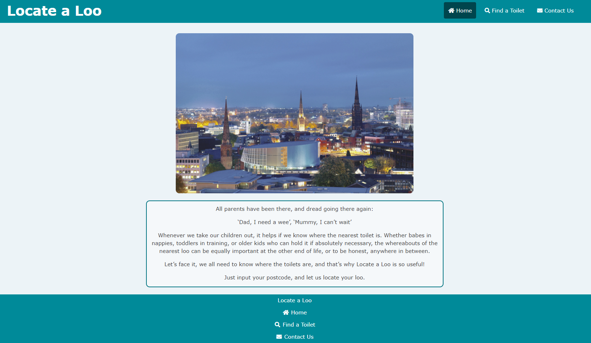
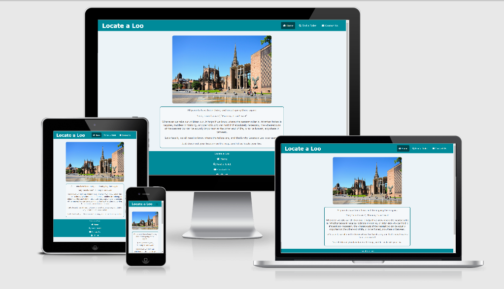
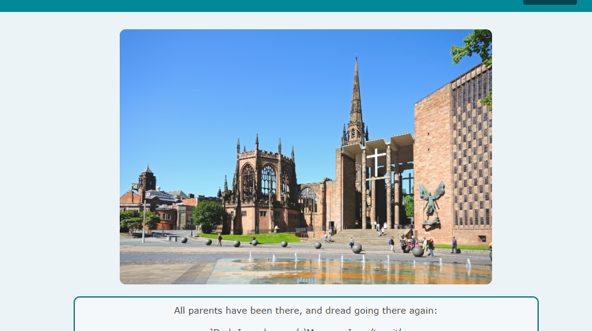
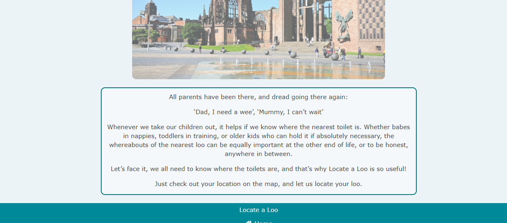
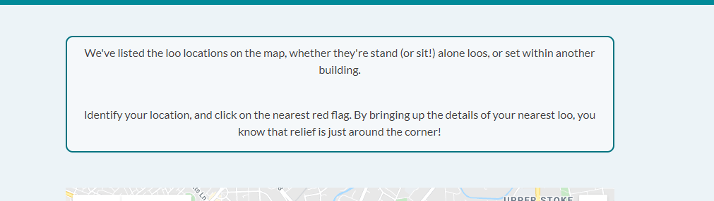
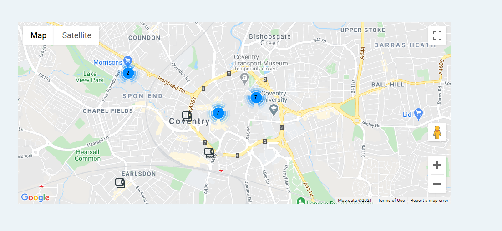
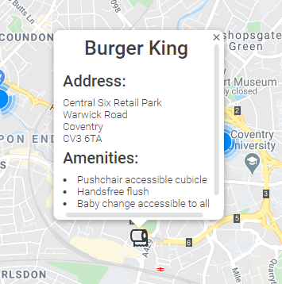
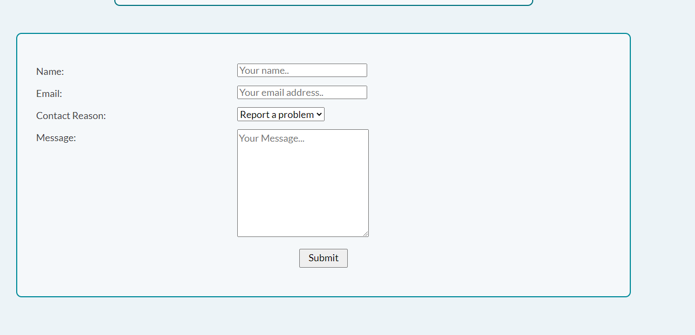

# Locate a Loo
## A Milestone 2 Project by Rachel Sherlock

[View the live project](https://rachel2308.github.io/locate-a-loo/index.html)

The idea for this website came about through my own experiences as a Mum and needing to find the nearest public toilet quickly whilst out with both babies in nappies 
and older children who can't wait. As well as knowing where the nearest toilet was, I felt that being able to make sure that the toilets had the facilities that you require 
would also be a useful feature. For example, knowing in advance that the baby changing facilities can only be accessed from within the ladies' toilets is critically important
for fathers.

I believed that the site should be kept simple so that people did not have to contend with complex navigation when they needed to get the information in a hurry. 

Although the site only currently features facilities in Coventry, the aim of the site is that it will eventually span the whole of the UK. This would be done 
through user interaction. The contact form enables the site to be kept up to date through users updating the available amenities, and also allows for this 
expansion of the site to other places through user input. 

## User Experience (UX)

As part of my research for the site, I spoke to members of a local facebook page for Mums. I asked them what they would find useful on a site such as this, and if it would be 
a site that they would use. The feedback was very positive with everyone saying that they would find this kind of site to be very useful for all ages. They also told me what 
they would find most useful for it to show and this has formed the basis of its features, and also for the features left to implement.

* **User Stories** 
    * **First Time User Goals**
        1. As a first time user, I will want to look to find where the nearest toilet is when in an area I do not know
        2. As a first time user, I will want to be able to use the maps feature to look for the fastest way to get to the toilet
        3. As a first time user, I will want to look at the amenities of a toilet to make sure that it will suit my needs before I get there

    * **Returning User Goals**
        1. I will want to help to update the site with any changes to the toilest that I frequently visit
        2. I will want to be able to plan ahead on trips out to make sure that local toilets have the facilities that I need
    
    * **Frequent User Goals**
        1. I will want to use the contact form to help to build and improve the site
        2. I will want to plan ahead and look for toilets in areas that I am planning on visiting

## Design

### Colour Scheme

According to colour psychology, green is one of the most calming colours. Due to the nature of the site, when people may be visiting it in a panic, 
I wanted to avoid the use of any stress inducing colours, such as red tones.

I have kept the colour scheme simple, with just 4 colours in use throughout the site. To make the site easier on the eyes, and again to 
create a more calming site, I have avoided having a white background and black text. Instead I have opted for dark grey text and an off white background. 
This avoids having too great a contrast on the site which can be harder on the eyes.

### Typography

I have kept to one simple font throughout the site, Late, with a backup font of sans serif. This is a clean and easy to use font, which will make the 
content easier to read.

### Imagery

The site has been kept light on images as it is primarily a site to be used when out and about on mobile so I wanted to keep the site clean and clear. However, on the 
home page I have added a slideshow to make that page interesting and capture user's attention. As one use of the site is for planning days out and knowing where 
the nearest toilets are, I have included eye-catching images of tourist attractions. While images of toilets may have been more relevant, they don't make for 
such attractive images and may put users off the site. 

### Wireframes

The wireframes for this site were created in balsamiq and uploaded as a PDF. They can be found as a PDF file [here](documentation/toileting-toddlers-pdf.pdf)

Some amendments were made to the wireframes once I started to build the site. Originally the site was called toileting toddlers as its primary use was to be an aid for parents
of toddlers who were toilet training. However I realised that this would limit its audience and therefore change the site to Locate a Loo. 

## Features

### Existing Features

### 1. Images

The front page contains a slideshow of images, designed to draw the eye and make the front page eye catching and interesting to look at.

### 2. Front Page content

The content on the front page enables uses to quickly see what the site is about, and will be used to include keywords to enable to site to improve its SEO.

### 3. Map content

The content on the map page gives a clear guide to how to use the maps. This is important for anyone that may not be used to how google maps works.

### 4. Map 

The map enables people to look for their location and see where the nearest public conveniences area

### 5. Map Pop-Up Boxes

Once the user has found their nearest toilet, they will be able to click on the flag to find out the full address, and the facilities that are availble. This 
will enable them to check that they are going to a toilet that best suits their needs.

### 6. Contact Form

User interaction is critical in order to help build out the site. The contact form will enable the current featured toilets to be kept up-yo-date with any changes
reported, and ultimately, the site can then be a nationwide site with public help. This will then mean that it can be used for checking ahead before a day out. 

### Features Left to Implement

### 1. Search Function

The ability to search by postcode or current location will help with making the site easier to navigate.

### 2. Directions

Incorporating a feature which gives directions to the public conveniences will also make the site far more user friendly.

### 3. Ratings

In the future, I would like to incorporate a cleanliness rating into the site. This will help with user interaction and 
enable people to avoid toilets that have been rated as unclean.

### 4. Breastfeeding guide

On either a separate page, or incorporated into the existing map page, in the future I would like to incorporate details on breastfeeding 
friendly locations.

### 5. Features Filter 

The ability to be able to filter the listed toilets would help the user experience. For example, showing only toilets that are accessible by car, or that 
the baby change facilities are accessible to all.

---

## Frameworks, Libraries and Programmes Used

1. [Bootstrap 4.4.1:](https://getbootstrap.com/docs/4.4/getting-started/introduction/) 
    * Bootstrap was used to help with the styling and responsiveness of the site.
2. [Hover.css:](https://ianlunn.github.io/Hover/) 
    * Hover.css was used on the links to change the styling
3. [Google Fonts:](https://fonts.google.com/) 
    * Google fonts were used to import the Lato font which is used throughout the site.
4. [Font Awesome:](https://fontawesome.com/) 
    * Font Awesome was used for the social media icons on the footer links, and the home, search and contact us icons in the header and footer.
5. [jQuery:](https://jquery.com/) 
    * jQuery came with Bootstrap and was used to create a responsive navbar.
6. [Git:](https://git-scm.com/) 
    * Git was used for version control by utilising the Gitpod terminal to commit to Git and Push to GitHub.
7. [GitHub:](https://github.com/) 
    * GitHub is used to store the project's code after being pushed from Git.
8. [Balsamiq:](https://balsamiq.com/) 
    * Balsamiq was used to design the site and create [wireframes](documentation/toileting-toddlers-pdf.pdf).
9. [Google maps platform:](https://developers.google.com/maps/documentation/javascript/overview)
    * Documentation on the Google Maps Platform page was used to incorporate the cluster markers and the info windows.
10. [W3 Schools](https://www.w3schools.com/w3css/w3css_slideshow.asp)
    * Tutorials from W3 schools formed the babis of the slideshow on the front page.
11. Languages used
    * HTML
    * CSS
    * JavaScript

## Testing 

The HTML and CSS were tested using W3C Markup Validator and W3C CSS Validator to ensure that there 
were no syntax errors on any of the pages of the project. 

* [W3C Markup Validator](https://validator.w3.org/nu/#textarea)
* [W3C CSS Validator](https://jigsaw.w3.org/css-validator/#validate_by_input)
* [JS Hint](https://jshint.com/)

Each page of Javascript, HTML and the CSS file were all checked. All results came back as completely clear of errors.

* Results
    * HTML
        * [Homepage]()
        * [Toilets]()
        * [Contact Us]()

    * [CSS]()

    * Javascript 
        * [email.js]()
        * [maps.js]()
        * [data.js]()
        * [home.js]()

### Testing User Stories from User Experience Section

* **User Stories** 
    * **First Time User Goals**
        1. As a first time user, I will want to look to find where the nearest toilet is when in an area I do not know

         * The map feature enables people to look for their location on the map to pinpoint where their nearest toilet is. This could be improved by the 
           addition of a "your location" feature, or a postcode look up. 

        
        
        2. As a first time user, I will want to be able to use the maps feature to look for the fastest way to get to the toilet

         * While the map doesn't currently show the fastest route, users can zoom in to manually check their route. This would be 
           improve with the addition of a live directions feature.

        3. As a first time user, I will want to look at the amenities of a toilet to make sure that it will suit my needs before I get there

         * On clicking the toilet roll on the map, a text box pops up giving the full address and any relevant information, like if there is a cubicle that can fit
           a pushchair in, if the toilets are accessible by car or on foot etc. This ensures that they can make sure that the toilet has the amenities that they need 
           before travelling. 

            

    * **Returning User Goals**
        1. As a returning user, I will want to help to update the site with any changes to the toilest that I frequently visit

         * The contact form will enable users to email to update the site with any changes to the facilities there, for example if the site once only had 
           a baby change that was accessible in the female toilets but have now added further facilities. 

             

        2. As a returning user, I will want to be able to plan ahead on trips out to make sure that local toilets have the facilities that I need

         * The info windows on the map will enable users to plan ahead on trips out and know what the facilities are like in the area that they are travelling to. 
           This will help them to know in advance if there are any toilets that they need to avoid as they do not suit their needs.
    
    * **Frequent User Goals**
        1. I will want to use the contact form to help to build and improve the site

         * In time, the site will grow through user interaction. The contact form will enable users to inform us of other toilets that they know of that we can 
           feature on the site.

        2. I will want to plan ahead and look for toilets in areas that I am planning on visiting

         * The site will give the users the ability to see where the nearest toilets are on a day out, and be able to avoid any areas with no suitable public toilets.

### Further Testing

* The Website was tested on:
    * Google Chrome 
    * Internet Explorer 
    * Microsoft Edge 
    * Firefox 
    * Safari 

* The website was viewed on a variety of devices such as 
   * Laptop 
   * iPhone7 
   * iPhone 11 
   * iPhoneX
   * Oppo A9
   * Huawei p20 pro

* A large amount of testing was done to ensure that links worked.
* Friends were asked to review the site on different devices, screenshot any issues and point out any bugs or 
user experience issues.

### Contact Form
1. Form cannot be submitted without a name.
2. Form cannot be submitted if a valid email address is not entered.
3. Text box must be completed for the form to be submitted.
4. When all sections of the form are completed, the form submits correctly and the Success message appears.
5. Success message only shows on contact form when all parts of the form are completed correctly and email is sent.
6. Form message is received by host email, and automatic repy is sent to user's email address.  

### Front Page Slideshow 
A complete round of the slideshow was viewed on different devices to ensure that all images render properly.

### Map
1. All toilet roll icons function and bring up the correct information
2. The clusterer markers cause the map to zoom in to reveal the toilet markers
3. Maps render on all devices well
4. Info windows are clear on all devices.

### Bugs

1. Input boxes overhanged the contact form at smaller screen sizes. This was corrected through the use of media galleries.
2. On the smallest screen size, the JS burger icon jumped to under the page name causing issues with the slideshow. This was
   corrected with the use of a media query to make the text smaller on smaller screen sizes.
3. The slideshow caused the text box underneath and the footer to move. This was corrected by resizing the images to ensure 
   the smooth transition between slides. 
4. On user testing it was found that some users were confused by the use of red flags to show where the toilets were. I have 
   changed the icon to a toilet roll, and also explained this in the content on that page to improve user experience. 
5. Some users found that the contact form labels did not render correctly on mobile. This was corrected through shortening the content.
6. Google maps embedded icons and teh clusterer markers did not originally show on the map. On investigation, I found that this was due to its code being 
   overwritten by my CSS. I amended the class names that were causing the issue and the icons then showed properly.
     
## Deployment

### GitHub Pages

**The project was deployed to GitHub Pages using the following steps**

1. Log in to GitHub and locate the GitHub Repository
2. Click the "Settings" button in the menu at the top of the Repository
3. Scroll down the Settings page to the "GitHub Pages" Section
4. Under "Source", click the dropdown called "None" and select "Master Branch".
5. Scroll back down through the page to find the site link in the "GitHub Pages" section.

**Running Locate a Loo Online Locally**

How to clone Locate a Loo from GitHub

1. Navigate to /rachel2308/locate-a-loo
2. Click on the green Code button
3. Select the code dropdown button beside the Gitpod button
4. Copy the URL listed.
5. Start up your IDE and navigate to the file location.
6. To clone, copy this code and input it into your terminal:

http://github.com/rachel2308/locatealoo.git

## Credits

### Code

* Code for the slideshow was adapted from [W3 Schools](https://www.w3schools.com/w3css/w3css_slideshow.asp)
* Code for the maps was adapted from [Google maps platform:](https://developers.google.com/maps/documentation/javascript/overview)
* Code for the navbar was adapted from [W3 Schools](https://www.w3schools.com/howto/howto_css_navbar_icon.asp)

### Content

All content on the site is original 

### Media

Thanks to my employers for the use of images from the works image library

### Acknowledgments

* Thanks to the Mums on the local facebook page for their input into the features that the site should have
* The Slack community for their help and support
* My mentor, Aaron Sinnot for his help throughout the project
* Katharine Allison, for her help with the content on the site

and most importantly

* My children, whose unending cries of "Mummy I need a wee" while out created the panic that inspired this project!
---

